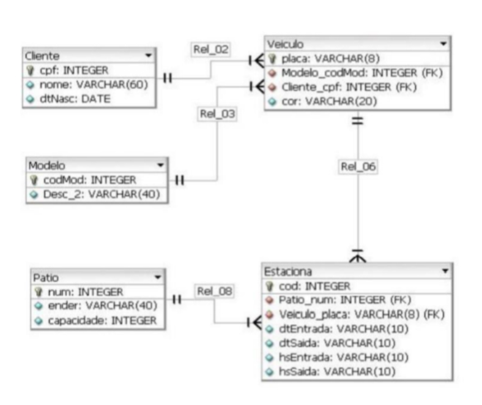

# F-Câmara
Repositorio com os exercicios do teste prático

## Questão 1 
Caixa Eletrônico Desenvolva um programa que simula a entrega de notas quando um cliente efetuar um saque em um caixa eletrônico. O requisitos básicos são os seguintes:
* Entregar o menor número de nodas;
* É possivel sacar o valor solicitado com as notas disponíveis;
* Saldo do cliente infinito;
* Quantidade de notas finitas (cadastrar a quantidade de cada nota disponível abaixo);
* Notas disponíveis de R$ 100,00; R$ 50,00; R$ 20,00 e R$ 10,00

Exemplos:
* Valor do Saque: R$ 30,00 - Resultado Esperado: Entregar 1 nota de R$ 20,00 e 1 nota de R$ 10,00.
* Valor do Saque: R$ 60,00 - Resultado Esperado: Entregar 1 nota de R$ 50,00 e 1 nota de R$ 10,00.
* Valor do Saque: R$ 80,00 - Resultado Esperado: Entragar 1 nota de R$ 50,00, 1 nota de R$ 20,00 e 1 nota de R$ 10,00

## Questão 2

Neste desafio de SQL, sua consulta deverá retornar os nomes das pessoas que são reportadas (excluindo valores nulos), o número de mebros que reportam a eles e a idade média desses membros como um número inteiro. As linhas devem ser ordenadas pelos nomes em ordem alfabética. Segue abaixo a tabela com as informações:

| ID | FirstName | LastName | ReportsTo      | Position   | Age |
| -- | ----------| -------- | -------------- | ---------- | --- |
|  1 | Daniel    | Smith    | Bob Boss       | Engineer   |  25 |
|  2 | Mike      | White    | Bob Boss       | Contractor |  22 |
|  3 | Jenny     | Richards | null           | CEO        |  45 |
|  4 | Robert    | Black    | Daniel Smith   | Sales      |  22 |
|  5 | Noah      | Fritz    | Jenny Richards | Assistant  |  30 |
|  6 | David     | S        | Jenny Richards | Director   |  32 |
|  7 | Ashley    | Wells    | Davidi S       | Assistant  |  25 |
|  8 | Ashley    | Johnson  | null           | Intern     |  25 |

## Questão 3

Neste desafio de SQL, implemente as consultas abaixo considerando o modelo conceitual abaixo e utilizando para realizar a junção *SOMENTE* os comando `INNER JOIN`, `LEFT OUTER JOIN` ou `RIGHT OUTER JOIN`:

1. Exiba a placa e o nome dos donos de todos os veículos
1. Exiba o endereço, a data de entrada e de saída dos estacionamentos do veículo de placa "BTG-2022"